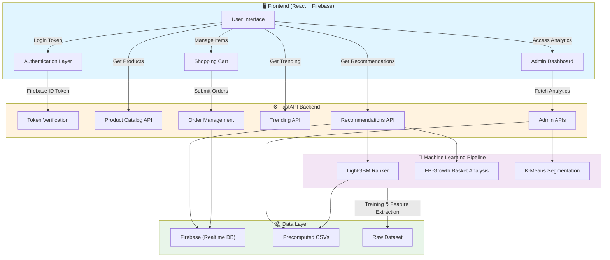
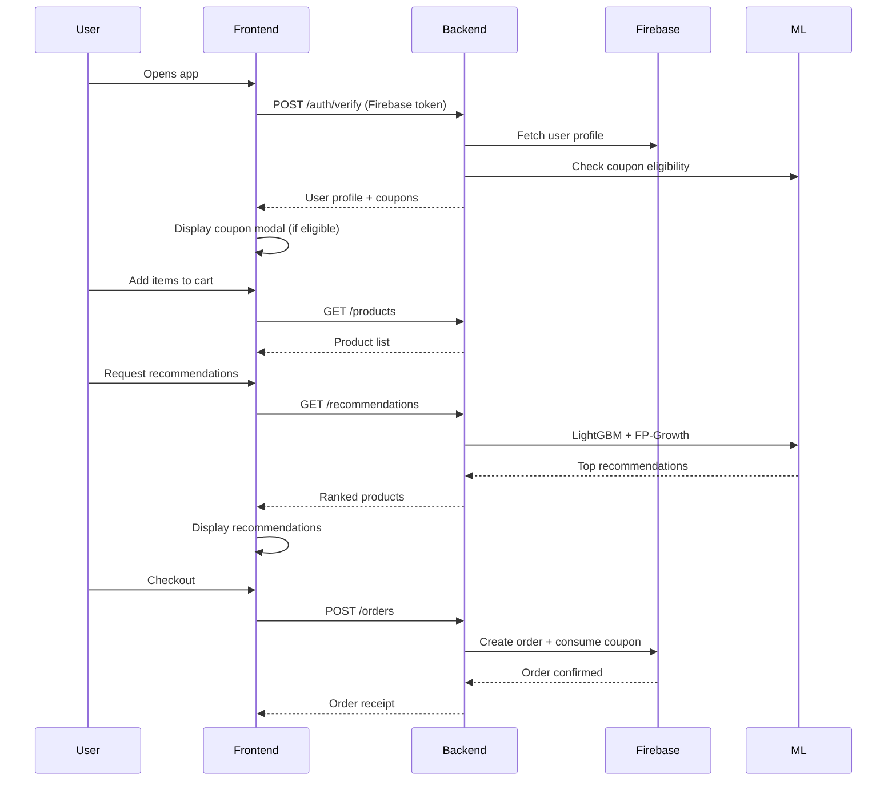
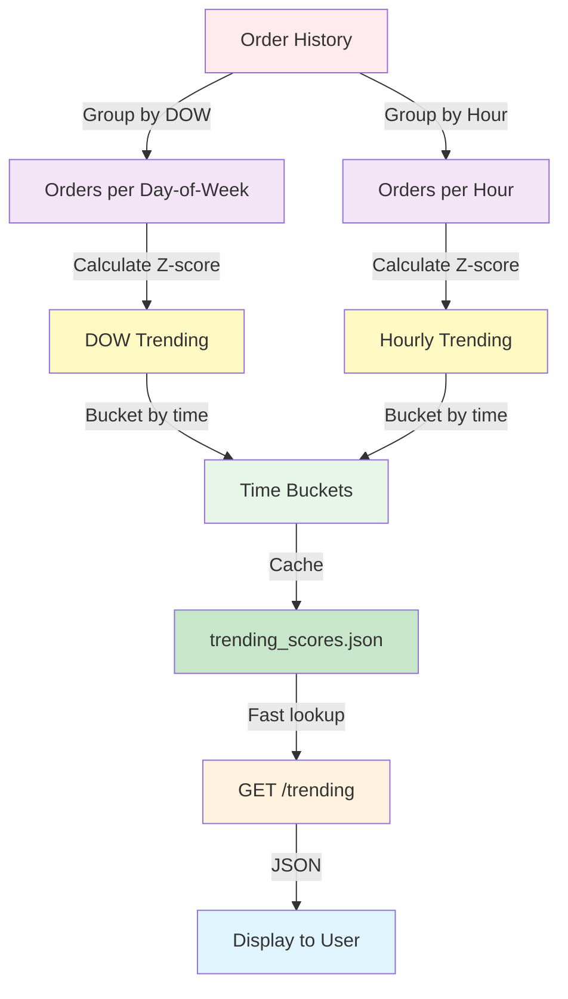
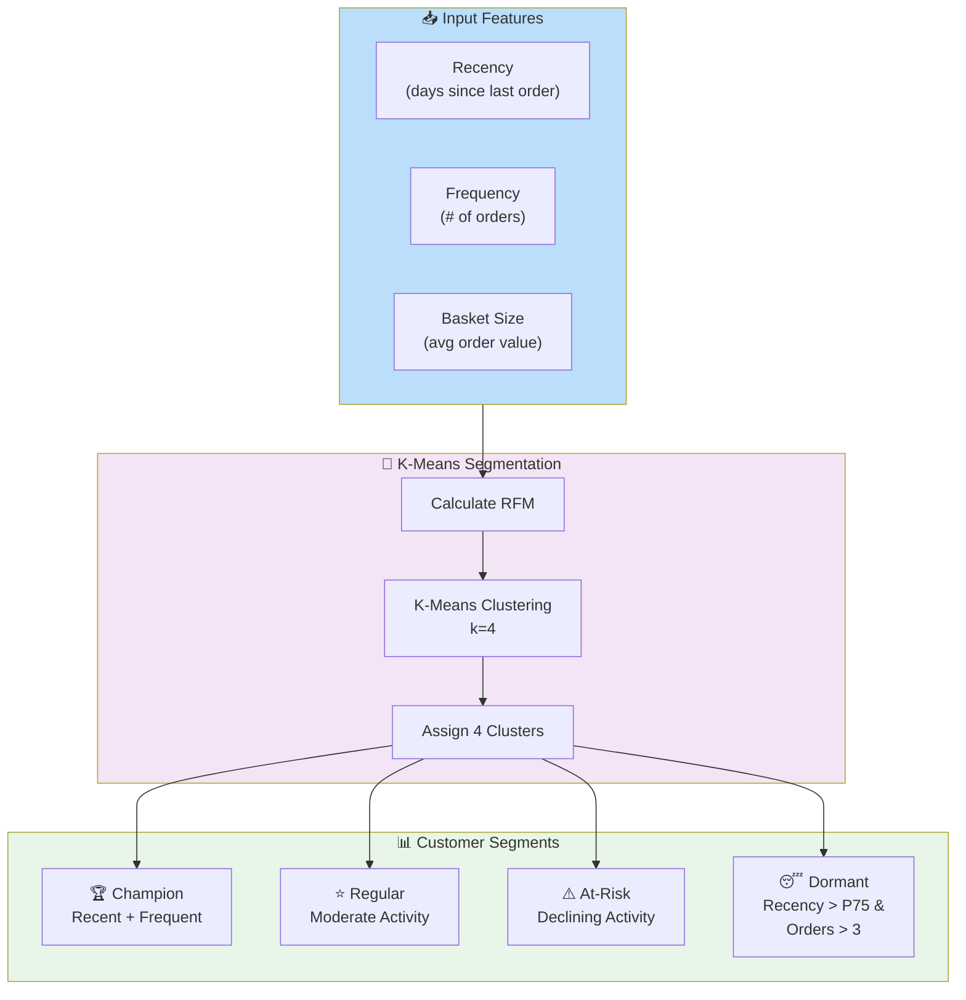
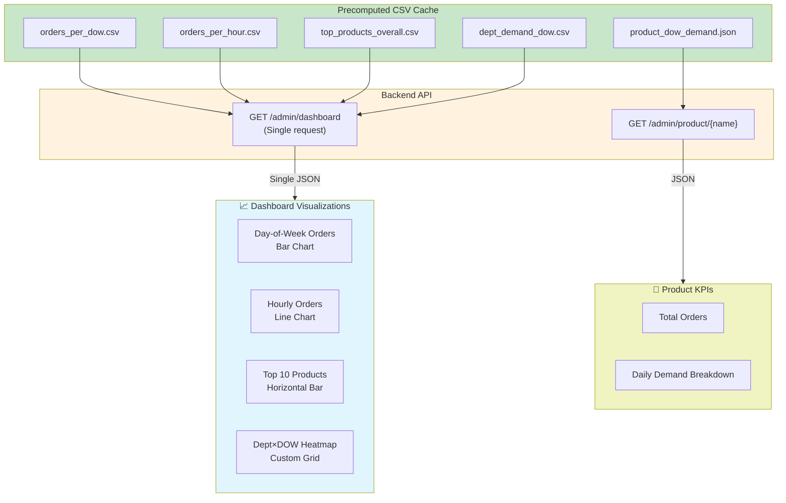
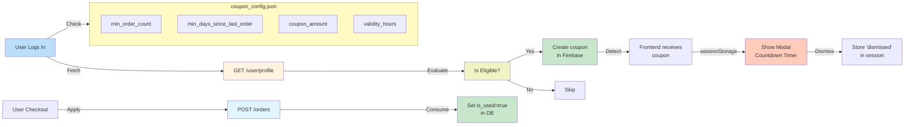

# 🛒 Instacart Smart Grocery - AI-Powered Recommendation & Inventory System

## Table of Contents
- [Overview](#overview)
- [System Architecture](#system-architecture)
- [Project Structure](#project-structure)
- [Key Features & Workflows](#key-features--workflows)
- [Technology Stack](#technology-stack)
- [Setup & Installation](#setup--installation)
- [Running the Application](#running-the-application)
- [API Documentation](#api-documentation)
- [Machine Learning Models](#machine-learning-models)
- [Data Preparation Notebooks](#data-preparation-notebooks)
- [Security & Authentication](#security--authentication)
- [Debugging & Monitoring](#debugging--monitoring)
- [Performance Optimization](#performance-optimization)
- [Data Refresh Schedule](#data-refresh-schedule)

---

## <a id="overview"></a>Overview

**Instacart Smart Grocery** is a full-stack, AI-powered e-commerce platform that combines intelligent product recommendations, real-time inventory management, customer segmentation, and demand forecasting. Built with React, FastAPI, and machine learning models, it delivers personalized shopping experiences while optimizing inventory and discovering win-back opportunities for inactive customers.

### Key Highlights

- 🤖 **AI-Driven Recommendations**: LightGBM + FP-Growth market basket analysis for personalized product suggestions
- 📊 **Admin Dashboard**: Real-time demand analytics, inventory optimization, and customer segmentation insights
- 🎫 **Coupon Campaigns**: Automated discount coupons for qualifying users based on order frequency and recency
- 🔐 **Firebase Authentication**: Secure, token-based authentication with no service account required
- ⚡ **Fast API**: Precomputed data strategy ensures sub-second dashboard response times

---

## <a id="system-architecture"></a>🏗️ System Architecture

### High-Level Data Flow



### Component Interaction Flow


---

## <a id="project-structure"></a>🗂️ Project Structure

```
.
├── backend/                          # FastAPI backend server
│   ├── main.py                      # Core API endpoints
│   ├── product_catalog.py           # Product data & departments
│   ├── recommendation_engine.py     # LightGBM + FP-Growth recommendations
│   ├── trending_engine.py           # Time-bucketed trending analysis
│   ├── reranker.py                  # Result reranking utilities
│   ├── coupon_config.json           # Customizable coupon eligibility rules
│   ├── requirements.txt             # Python dependencies
│   └── serviceAccountKey.json       # Firebase credentials
│
├── frontend/                         # React + Vite application
│   ├── src/
│   │   ├── main.jsx                 # Entry point
│   │   ├── App.jsx                  # Routing configuration
│   │   ├── api.js                   # Backend API client
│   │   ├── firebase.js              # Firebase initialization
│   │   ├── index.css                # Global styles
│   │   ├── components/
│   │   │   ├── Navbar.jsx           # Top navigation bar
│   │   │   ├── CartDrawer.jsx       # Shopping cart sidebar
│   │   │   ├── ProductCard.jsx      # Product card component
│   │   │   ├── CouponModal.jsx      # Coupon display modal
│   │   │   ├── TrendingSection.jsx  # Trending products section
│   │   │   └── Toast.jsx            # Toast notifications
│   │   ├── context/
│   │   │   ├── AuthContext.jsx      # Authentication state
│   │   │   ├── CartContext.jsx      # Shopping cart state
│   │   │   └── ThemeContext.jsx     # Theme state management
│   │   ├── pages/
│   │   │   ├── HomePage.jsx         # Main landing page
│   │   │   ├── CartPage.jsx         # Checkout page
│   │   │   ├── AdminDashboardPage.jsx  # Admin analytics dashboard
│   │   │   ├── LoginPage.jsx        # Authentication page
│   │   │   └── OrderHistoryPage.jsx # Order history
│   │   ├── data/
│   │   │   └── products.js          # Static product data
│   │   └── assets/                  # Images & static files
│   ├── public/                       # Static assets
│   ├── package.json                 # Node dependencies
│   ├── vite.config.js               # Vite configuration
│   └── eslint.config.js             # Linting rules
│
├── models/                           # ML model utilities
│   ├── lightgbm_model.py            # LightGBM model wrapper
│   ├── market_basket.py             # FP-Growth implementation
│   └── memory_utils.py              # Memory optimization utilities
│
├── notebooks/                        # Data science & analysis
│   ├── eda.ipynb                    # General EDA
│   ├── feature_engineering.ipynb    # Feature extraction
│   ├── eda_trending_products.ipynb  # Trending analysis
│   ├── build_trending_data.py       # Generate trending data
│   ├── customer_segmentation/
│   │   ├── customer_segmentation_eda.ipynb      # Segmentation analysis
│   │   └── customer_segmentation_fe.ipynb       # Segmentation ML pipeline
│   └── demand_forecasting/
│       ├── eda.ipynb                # Demand exploration
│       └── fe.ipynb                 # Demand feature engineering
│
├── data/                             # Data files
│   ├── combined_instacart_data.csv  # Raw dataset
│   └── precomputed/                 # Precomputed cache
│       ├── user_segments.csv        # Customer clusters
│       ├── product_dow_demand.json  # Day-of-week demand by product
│       ├── top_products_overall.csv # All-time top products
│       ├── orders_per_dow.csv       # Orders by day-of-week
│       ├── orders_per_hour.csv      # Orders by hour-of-day
│       ├── dept_demand_dow.csv      # Department demand by DOW
│       └── user_features.csv        # User demographic features
│
├── outputs/                         # Generated model outputs
│   ├── lgbm_model.txt               # Serialized LightGBM model
│   └── trending_scores.csv          # Precomputed trending scores
│   ├── lgbm_feature_cols.pkl        # Serialized feature columns for LightGBM inference
│   ├── lgbm_threshold.json          # Optimal probability threshold for classification
│   ├── mba_rules.pkl                # FP-Growth extracted association rules
│   ├── train_features.parquet       # Full engineered LightGBM training feature matrix
│   ├── product_names.parquet        # Parquet product metadata table
│   ├── order_products.parquet       # Parquet order-to-product mapping database
│   ├── trending_scores.parquet      # Complete computed trending scores by context
│   ├── trending_scores.csv          # Human-readable sample of top trending scores
│   ├── trending_departments.parquet # Parquet department-level trending scores
│   ├── trending_lookup.pkl          # Pickled dictionary for instant O(1) trending API calls
│   └── README.md                    # Outputs folder documentation guide
│
├── precompute_admin_data.py         # Generate admin dashboard cache
├── generate_segmentation.py         # Generate segmentation data
├── requirements.txt                 # Python project dependencies
└── README.md                        # This file
```

---

## <a id="key-features--workflows"></a>🚀 Key Features & Workflows

### 1️⃣ Product Recommendations Engine

**Architecture**: Two-stage ranking using LightGBM + FP-Growth

**How it works**:
- **Stage 1 - LightGBM**: Ranks all products based on user's historical purchase patterns
- **Stage 2 - FP-Growth**: Finds frequently co-purchased items with products in the user's cart
- **Combination**: Merges both rankings, deduplicates, and filters by department preferences

**API Endpoint**: `GET /recommendations?user_id=<uid>`

---

### 2️⃣ Trending Products Discovery

**Time-Bucketed Analysis**



**Time Buckets**: Morning (6-10am), Afternoon (11-15h), Evening (16-20h), Night (21-5am)

**API Endpoints**:
- `GET /trending` - Homepage trending (time-aware)
- `GET /trending/departments` - Trending by department

---

### 3️⃣ Customer Segmentation

**ML Pipeline**: K-Means Clustering



**How it works**:
- **RFM Analysis**: Users are grouped based on Recency, Frequency, and Monetary (avg basket size) values.
- **K-Means Clustering**: Grouping is performed using the K-Means algorithm to partition users into 4 distinct behavioral segments: Champion, Regular, At-Risk, and Dormant.
- **Admin Dashboard**: Visualize segments using donut charts and scatter plots to understand customer distributions.

**API Endpoints**:
- `GET /admin/segmentation` - Cluster data for charts

---

### 4️⃣ Admin Dashboard: Demand & Product Order Intelligence

**Real-Time Analytics from Precomputed Cache**



**API Endpoints**:
- `GET /admin/dashboard` - All high-level demand metrics (CSV-backed)
- `GET /admin/inventory` - Search and retrieve product names from demand history
- `GET /admin/product/{product_name}` - Product total orders and daily demand breakdown (JSON-backed)

For a detailed breakdown of the features, backend configurations, and visualization columns used for each dashboard section, see the [Admin Dashboard Technical Guide](docs/ADMIN_DASHBOARD_README.md).

---

### 5️⃣ Coupon System & User Engagement

**Automated Eligibility & Delivery**



**Customization**: Edit `backend/coupon_config.json` without restarting the server:

```json
{
  "min_order_count": 3,
  "min_days_since_last_order": 30,
  "coupon_amount": 50,
  "validity_hours": 48
}
```

---

## <a id="technology-stack"></a>🛠️ Technology Stack

### Backend
- **FastAPI** - High-performance Python web framework
- **Pydantic** - Data validation & serialization
- **PyJWT** - Firebase token verification
- **Pandas** - Data manipulation & CSV parsing
- **LightGBM** - Gradient boosting recommendation ranker
- **MLxtend** - FP-Growth market basket analysis
- **Firebase Admin SDK** - Realtime database & authentication

### Frontend
- **React 19** - UI framework
- **React Router v7** - Client-side routing
- **Firebase SDK** - Auth, Realtime DB, Analytics
- **Recharts** - Data visualization library
- **Vite** - Modern build tool & dev server
- **CSS3** - Styling (with responsive design)

### Machine Learning & Data Science
- **LightGBM** - Gradient boosting recommendation ranker
- **Scikit-learn** - ML utilities, preprocessing
- **Pandas & NumPy** - Data manipulation
- **Jupyter Notebooks** - Exploratory analysis & model training
- **Matplotlib & Seaborn** - Visualization

### Infrastructure
- **Firebase** - Authentication, Realtime DB, Storage
- **Google Cloud** - Hosting & credentials
- **Docker** - Containerization (optional)

---

## <a id="setup--installation"></a>📋 Setup & Installation

### Prerequisites
- **Node.js 18+** and npm
- **Python 3.9+** with pip or conda
- **Firebase Project** with credentials
- **Git**

### Step 1: Clone & Install Backend Dependencies

```bash
cd backend
pip install -r requirements.txt
```

### Step 2: Configure Backend

1. Create or obtain your Firebase service account key:
   - Go to [Firebase Console](https://console.firebase.google.com/)
   - Select your project
   - Settings → Service Accounts
   - Generate new private key → save as `serviceAccountKey.json`

2. Place `serviceAccountKey.json` in the `backend/` directory

3. Update environment variables (or `.env` file):

```bash
export GOOGLE_CLOUD_PROJECT="your-firebase-project-id"
export FIREBASE_API_KEY="your-api-key"
```

### Step 3: Install Frontend Dependencies

```bash
cd frontend
npm install
```

### Step 4: Configure Firebase in Frontend

Update `frontend/src/firebase.js` with your Firebase config:

```javascript
const firebaseConfig = {
  apiKey: "YOUR_API_KEY",
  authDomain: "your-project.firebaseapp.com",
  projectId: "your-project-id",
  storageBucket: "your-project.appspot.com",
  messagingSenderId: "your-sender-id",
  appId: "your-app-id",
};
```

### Step 5: Prepare ML Models & Precomputed Data

```bash
# Generate precomputed cache (admin dashboard data)
python precompute_admin_data.py

# Generate customer segments
python generate_segmentation.py

# Build trending data
cd notebooks
python build_trending_data.py
```

---

## <a id="running-the-application"></a>🚀 Running the Application

### Start Backend Server

```bash
cd backend
python -m uvicorn main:app --reload --host 0.0.0.0 --port 8000
```

Backend will be available at: `http://localhost:8000`
API Docs: `http://localhost:8000/docs`

### Start Frontend Development Server

```bash
cd frontend
npm run dev
```

Frontend will be available at: `http://localhost:5173`

### Access the Application

- **User App**: `http://localhost:5173`
- **Admin Dashboard**: `http://localhost:5173/admin` (login required)
- **API Swagger Docs**: `http://localhost:8000/docs`

---

## <a id="api-documentation"></a>📡 API Documentation

### Authentication

All endpoints (except `/products` and `/trending`) require Firebase authentication.

**Header**: `Authorization: Bearer <firebase_id_token>`

### Product & Catalog APIs

| Endpoint | Method | Description |
|----------|--------|-------------|
| `/products` | GET | List all products or by department |
| `/products/{product_id}` | GET | Get single product details |
| `/departments` | GET | List all departments |

**Example**:
```bash
curl http://localhost:8000/products?department=produce
```

### Recommendation APIs

| Endpoint | Method | Description |
|----------|--------|-------------|
| `/recommendations` | GET | Get personalized recommendations for user |

**Query Params**:
- `user_id` - User ID (required)
- `count` - Number of recommendations (default: 20)

**Response**:
```json
{
  "recommendations": [
    {
      "product_id": "123",
      "name": "Organic Bananas",
      "score": 0.95,
      "reason": "Based on your purchase history"
    }
  ]
}
```

### Trending APIs

| Endpoint | Method | Description |
|----------|--------|-------------|
| `/trending` | GET | Get time-aware trending products |
| `/trending/departments` | GET | Trending by department |

**Query Params**:
- `time_bucket` - Optional: 'morning', 'afternoon', 'evening', 'night'
- `count` - Number of results (default: 10)

### Admin APIs

| Endpoint | Method | Description |
|----------|--------|-------------|
| `/admin/dashboard` | GET | Combined analytics data |
| `/admin/inventory` | GET | Product inventory list (paginated) |
| `/admin/product/{name}` | GET | Detailed product metrics & KPIs |
| `/admin/segmentation` | GET | Customer segment clusters |

### User & Order APIs

| Endpoint | Method | Description |
|----------|--------|-------------|
| `/user/profile` | GET | Get user profile + active coupons |
| `/orders` | POST | Create new order |
| `/orders/{order_id}` | GET | Get order details |
| `/user/history` | GET | Order history |

---

## <a id="machine-learning-models"></a>🧠 Machine Learning Models

### 1. LightGBM Recommendation Ranker

**Purpose**: Rank products based on user preferences

**Features**:
- User purchase frequency
- Product popularity
- Department affinity
- Seasonality signals

**Output**: Top 100 ranked candidates (Stage 1)

**File**: `backend/recommendation_engine.py`

**Model Selection Rationale**:
I chose LightGBM because it gave a good balance of speed and a good F1-score. I tried different models like Logistic Regression, XGBoost, LightGBM, and CatBoost. XGBoost gave a slightly higher F1-score, but the difference was too low while XGBoost was computationally very heavy. LightGBM gave a great F1-score with very fast computation.

### 2. FP-Growth Market Basket Analysis

**Purpose**: Find frequently co-purchased items

**Algorithm**: 
- Min support threshold: 0.02 (2% of baskets)
- Min confidence: 0.5 (50% co-purchase rate)

**Output**: Related items to combine with LightGBM (Stage 2)

**File**: `backend/recommendation_engine.py`

**Model Selection Rationale**:
I used FP-Growth because it is fast, memory-efficient, and works well for market basket analysis by finding products frequently bought together without generating too many combinations like Apriori. This makes it highly suitable for large datasets like Instacart and useful for recommending products to cold users.

### 3. K-Means Customer Segmentation

**Purpose**: Group customers into 4 behavioral segments

**Algorithm**: K-Means clustering on RFM features
- **Features**: Recency, Frequency, Monetary Value
- **Clusters**: Champion, Regular, At-Risk, Dormant
- **Training**: `notebooks/customer_segmentation/customer_segmentation_fe.ipynb`

**Model Selection Rationale**:
I chose K-Means because it is more efficient and faster compared to many other clustering algorithms because it works by finding the nearest cluster center using distance calculations. It performs well on large datasets like Instacart and creates clear user groups quickly. Other algorithms like Hierarchical Clustering are slower on large data, DBSCAN may create uneven clusters, and Gaussian Mixture Models are more complex and computationally expensive. K-Means gives a good balance of speed, simplicity, scalability, and easy interpretation.

**Optimal K Evaluation (Elbow Graph)**:


## <a id="data-preparation-notebooks"></a>📊 Data Preparation Notebooks

### Notebooks Overview

| Notebook | Purpose | Output |
|----------|---------|--------|
| `eda.ipynb` | General exploratory analysis | Insights, visualizations |
| `feature_engineering.ipynb` | Feature extraction | Processed features |
| `eda_trending_products.ipynb` | Trending product analysis | Trending scores |
| `customer_segmentation_eda.ipynb` | User behavior exploration | RFM analysis, insights |
| `customer_segmentation_fe.ipynb` | ML pipeline (K-Means clustering) | `user_segments.csv` |
| `demand_forecasting/eda.ipynb` | Demand pattern analysis | Demand metrics |
| `demand_forecasting/fe.ipynb` | Demand feature engineering | Forecast features |

### Running Notebooks

```bash
cd notebooks
jupyter notebook

# Or use Jupyter Lab
jupyter lab
```

### Key Outputs Generated

- `data/precomputed/user_segments.csv` - Customer clusters for admin charts
- `data/precomputed/product_dow_demand.json` - Day-of-week demand by product
- `outputs/lgbm_model.txt` - Serialized LightGBM recommendation model
- `outputs/trending_scores.csv` - Precomputed trending scores

---

## <a id="security--authentication"></a>🔐 Security & Authentication

### Firebase Token Verification

The backend verifies Firebase ID tokens without a service account:

```python
def verify_firebase_token(token: str) -> dict:
    """
    1. Fetch Google's public certificates (cached 1 hour)
    2. Extract key ID from token header
    3. Verify signature using public cert
    4. Validate issuer, audience, expiration
    """
```

**Benefits**:
- ✅ No service account file in production
- ✅ Certificates auto-rotate with Google
- ✅ Standard JWT verification
- ✅ Fully stateless (horizontally scalable)

### CORS Configuration

```python
CORSMiddleware(
    allow_origins=["http://localhost:5173", "your-frontend-domain"],
    allow_credentials=True,
    allow_methods=["*"],
    allow_headers=["*"],
)
```

---

## <a id="debugging--monitoring"></a>🐛 Debugging & Monitoring

### Backend Logging

Enable debug mode:

```bash
# Verbose logging
export LOG_LEVEL=DEBUG
python -m uvicorn main:app --reload

# Check logs
tail -f backend.log
```

### Frontend Dev Tools

```bash
# Check console errors
# Browser DevTools → Console

# React DevTools extension
# React components tree → State inspection

# Network tab
# View API requests & responses
```

### Common Issues

| Issue | Solution |
|-------|----------|
| `403 Unauthorized` | Verify Firebase token, check CORS headers |
| `Slow admin dashboard` | Regenerate precomputed cache (`precompute_admin_data.py`) |
| `Recommendation not appearing` | Ensure LightGBM model is loaded in `recommendation_engine.py` |
| `Coupon modal not showing` | Check `coupon_config.json` eligibility rules |

---

## <a id="performance-optimization"></a>📈 Performance Optimization

### Caching Strategy

1. **Precomputed CSV Cache**: Admin dashboard data computed offline
   - Regenerate daily or on-demand
   - Sub-second JSON API response times
   
2. **Firebase Token Cache**: Google certificates cached 1 hour
   - Auto-refreshes on invalid key ID
   - Reduces external API calls

3. **Frontend Caching**:
   - sessionStorage for coupon modal state
   - localStorage for user preferences

### Database Indexing

Recommended Firebase indexes:

```
/users
  .indexOn: ["segment", "has_active_coupon", "last_order_date"]

/orders
  .indexOn: ["user_id", "created_at", "is_active"]

/coupons
  .indexOn: ["user_id", "is_used", "expires_at"]
```

---

## <a id="data-refresh-schedule"></a>🔄 Data Refresh Schedule

| Component | Frequency | Command |
|-----------|-----------|---------|
| Customer segments | Weekly | `python generate_segmentation.py` |
| Admin cache | Daily | `python precompute_admin_data.py` |
| Trending products | Daily | `python notebooks/build_trending_data.py` |
| LightGBM model | Monthly | Retrain via notebook |

---
